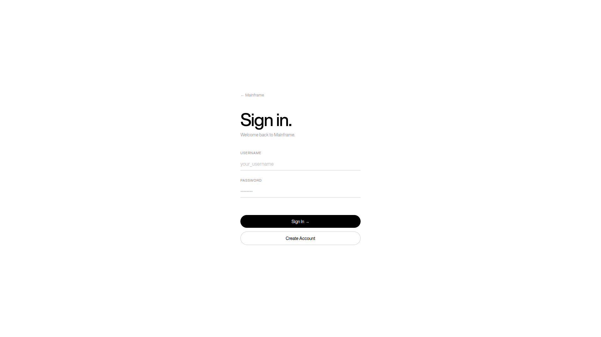

# Mainframe

Advanced AI Interview Simulator powered by Google Gemini.

<p align="center">
  
  
</p>

## Overview

Mainframe is a high-precision career readiness platform designed to simulate professional interviews with real-time evaluation. Utilizing A.R.I.A (Adaptive Response Interface Agent), the system provides an automated, data-driven environment for mastering interview performance across various sectors and roles.

## Core Capabilities

- **Intelligent Question Generation**: Dynamic MCQ engine capable of simulating Technical, HR, and Situational interviews for over 20 professional roles.
- **On-Demand Deep Analysis**: Real-time evaluation of user responses using sophisticated AI models to provide precise educational feedback.
- **Performance Intelligence**: Detailed tracking of accuracy metrics, historical trends, and category-specific performance data.
- **Adaptive Learning Systems**: Personalized study roadmaps generated based on individual performance history to target specific areas for improvement.
- **Persistent Architecture**: Secure session management ensuring progress is maintained across local environments.

## Technical Architecture

- **Interface**: React 19, TypeScript, Vite, Tailwind CSS.
- **Core Engine**: Flask (Python), SQLite3.
- **Intelligence**: Google Gemini 3.1 Flash Lite API.
- **Design Philosophy**: Minimalist, editorial-style aesthetic focusing on clarity and professional focus.

## Installation and Execution

### Backend Configuration

1. Initialize the Python environment:
   ```bash
   python3 -m venv venv
   source venv/bin/activate
   pip install -r requirements.txt
   ```

2. Configure environment variables in a `.env` file:
   ```env
   GEMINI_API_KEY=your_api_key
   ```

3. Initiate the API server:
   ```bash
   python3 app.py
   ```

### Frontend Configuration

1. Install dependencies and start the development server:
   ```bash
   npm install
   npm run dev
   ```

The platform will be accessible at `http://localhost:5173`.

## Licensing

Distributed under the MIT License. See `LICENSE` for more information.

## Acknowledgments

- **Motion Sites**: Special recognition to [Motion Sites](https://motionsites.ai/) for providing essential animation resources and aesthetic direction.
- **Google Generative AI**: Powered by the Gemini family of models for high-speed, accurate simulations.

---
Mainframe is developed and maintained by [Rahul-encc](https://github.com/Rahul-encc).
